Rgadget is a set of useful utilities for gadget, a statistical
multi-species multi-area marine ecosystem modelling toolbox.

This package aids in the developement of Gadget models in a number of
ways. It can interact with Gadget, by manipulating input files, digest
output and rudimentary plots.

Prerequisites
-------------
Gadget obviously, can be obtained from github.com/hafro/gadget

Installing
----------
You can use devtools to install this directly:


```r
# install.packages("devtools")
devtools::install_github("hafro/rgadget")
```


Using
-----
To use Rgadget you will need to load it into memory:

```r
library(Rgadget)

theme_set(theme_light()) ## set the plot theme (optional)

library(patchwork)  ## optional packages 
scale_fill_crayola <- function(n = 100, ...) {
  
  # taken from RColorBrewer::brewer.pal(12, "Paired")
  pal <- c("#A6CEE3", "#1F78B4", "#B2DF8A", "#33A02C",
           "#FB9A99", "#E31A1C", "#FDBF6F", "#FF7F00",
           "#CAB2D6", "#6A3D9A", "#FFFF99", "#B15928")
  pal <- rep(pal, n)
  ggplot2::scale_fill_manual(values = pal, ...)
  
}
```


To illustrate the use of Gadget we will use a model for cod in Icelandic waters atteched to the package. You can access the model using the following code: 

```r
system.file('extdata', 'cod_model.tgz', package = 'Rgadget') %>% 
  untar(exdir = path.expand('./gadget_example/'))

## change the working directory to the location of the gadget model
setwd('gadget_example/cod_model')
```

To estimate the model parameters the suggested procedure is to use the iterative reweighting approach with is implemented in the `gadget.iterative` function (see `?gadget.iterative` for further details).


```r
gadget.iterative(main='main',
                 grouping=list(sind1=c('si.gp1','si.gp1a'),
                               sind2=c('si.gp2','si.gp2a'),
                               sind3=c('si.gp3','si.gp3a')),
                 params.file = 'params.in',
                 wgts='WGTS')
```

This function calls Gadget which behind the scenes does the parameter estimation which we will use. To obtain information on the model fit and properties of the model one can use the `gadget.fit` function to query the model:


```r
fit <- gadget.fit()
```

The `fit` object is essentially a list of data.frames that contain the likelihood data merged with the model output. 


```r
fit %>% names()
```

```
##  [1] "sidat"             "resTable"          "nesTable"         
##  [4] "suitability"       "stock.growth"      "stock.recruitment"
##  [7] "res.by.year"       "stomachcontent"    "likelihoodsummary"
## [10] "catchdist.fleets"  "stockdist"         "SS"               
## [13] "stock.full"        "stock.std"         "stock.prey"       
## [16] "fleet.info"        "predator.prey"     "params"           
## [19] "catchstatistics"
```

and one can access those data.frames simply by calling their name:

```r
fit$sidat
```

```
## # A tibble: 135 x 20
##    name  area  label  year  step number intercept slope   sse stocknames
##    <chr> <chr> <chr> <int> <int>  <dbl>     <dbl> <dbl> <dbl> <chr>     
##  1 si.g… area1 leng…  1985     2 2.31e8     -35.3  2.21  4.53 codimm    
##  2 si.g… area1 leng…  1986     2 1.53e8     -35.3  2.21  4.53 codimm    
##  3 si.g… area1 leng…  1987     2 8.71e7     -35.3  2.21  4.53 codimm    
##  4 si.g… area1 leng…  1988     2 1.18e8     -35.3  2.21  4.53 codimm    
##  5 si.g… area1 leng…  1989     2 9.48e7     -35.3  2.21  4.53 codimm    
##  6 si.g… area1 leng…  1990     2 1.48e8     -35.3  2.21  4.53 codimm    
##  7 si.g… area1 leng…  1991     2 1.13e8     -35.3  2.21  4.53 codimm    
##  8 si.g… area1 leng…  1992     2 5.16e7     -35.3  2.21  4.53 codimm    
##  9 si.g… area1 leng…  1993     2 1.20e8     -35.3  2.21  4.53 codimm    
## 10 si.g… area1 leng…  1994     2 1.58e8     -35.3  2.21  4.53 codimm    
## # … with 125 more rows, and 10 more variables: sitype <chr>,
## #   fittype <chr>, length <chr>, age <chr>, survey <chr>, fleet <chr>,
## #   observed <int>, lower <int>, upper <int>, predict <dbl>
```

For further information on what the relevant data.frames contain refer to the help page for `gadget.fit`. 

In addition a plot routine for the `fit` object is implement in Rgadget. The input to the `plot` function is simply the `gadget.fit` object, the data set one wants to plot and the type. The default plot is a survey index plot:

```r
plot(fit)
```

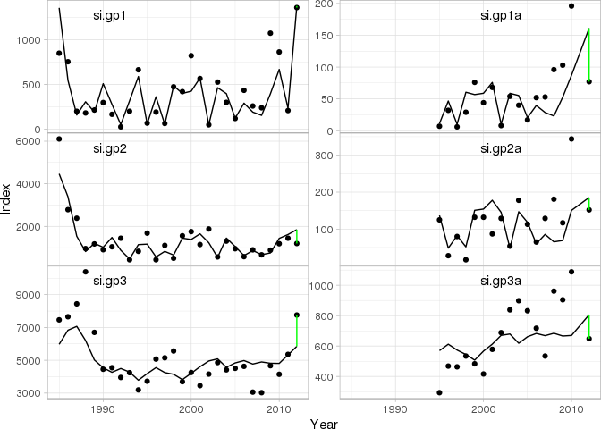<!-- -->

To produce a likelihood summary:

```r
plot(fit,data='summary')
```

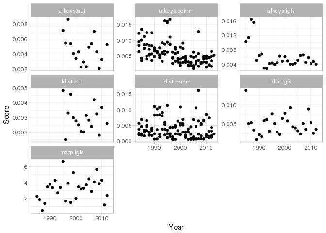<!-- -->

A weighted summary plot:

```r
plot(fit,data='summary',type = 'weighted')
```

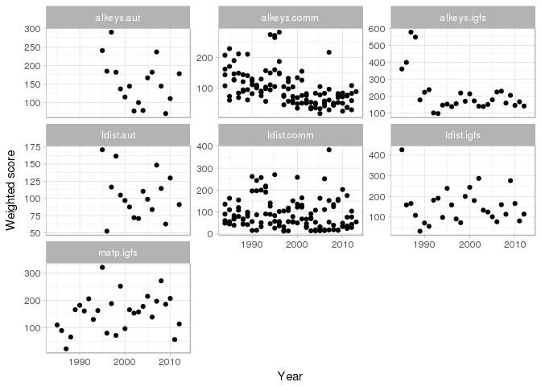<!-- -->

and an pie chart of likelihood components:

```r
plot(fit,data='summary',type='pie')
```

```
## Warning in RColorBrewer::brewer.pal(n, pal): n too large, allowed maximum for palette Spectral is 11
## Returning the palette you asked for with that many colors
```

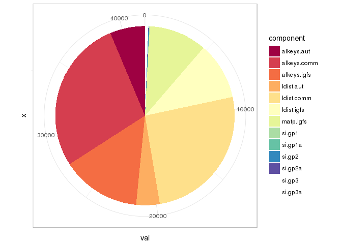<!-- -->

To plot the fit to catch proportions (either length or age) you simply do:

```r
tmp <- plot(fit,data = 'catchdist.fleets')
names(tmp)
```

```
## [1] "alkeys.aut"  "alkeys.comm" "alkeys.igfs" "ldist.aut"   "ldist.comm" 
## [6] "ldist.igfs"
```

and then plot them one by one:

```r
tmp$alkeys.aut
```

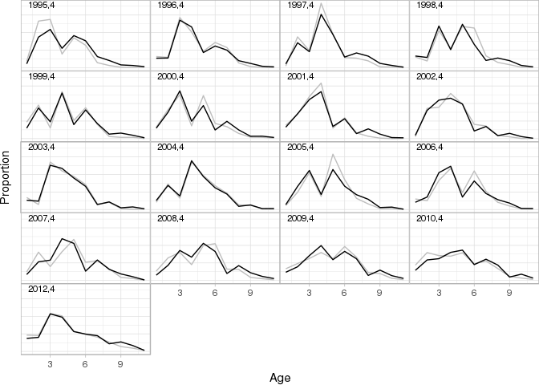<!-- -->

```r
tmp$ldist.aut
```

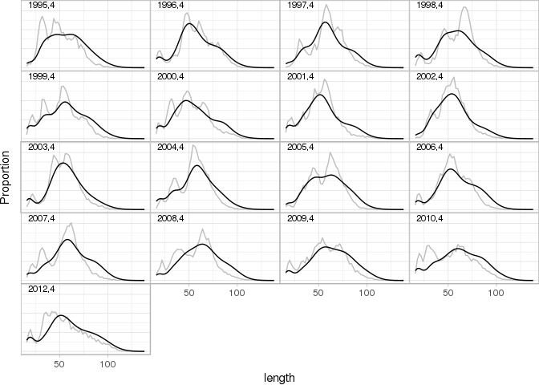<!-- -->


One can also produce bubble plots

```r
bubbles <- plot(fit,data = 'catchdist.fleets',type='bubble')
```

```
## Joining, by = "name"
## Joining, by = "name"
```

```r
names(bubbles)
```

```
## [1] "ldist"  "aldist"
```

Age bubbles

```r
bubbles$aldist
```

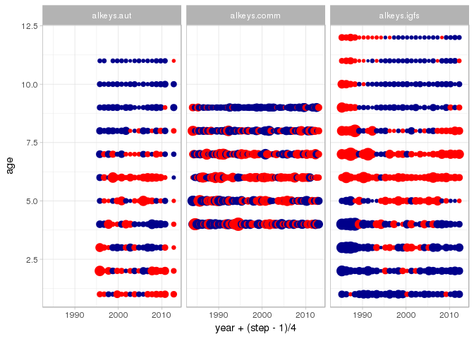<!-- -->

Length bubbles

```r
bubbles$ldist
```

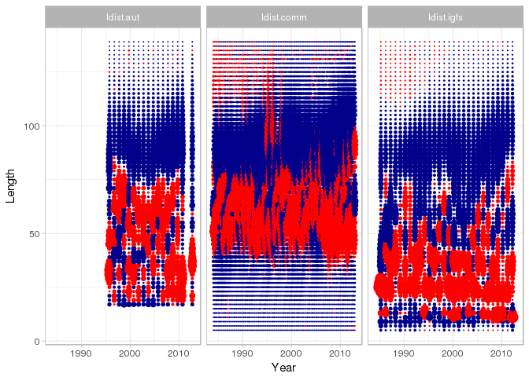<!-- -->

One can also illustrate the fit to growth in the model:

```r
grplot <- plot(fit,data = 'catchdist.fleets',type='growth')
names(grplot)
```

```
## [1] "alkeys.aut"  "alkeys.comm" "alkeys.igfs"
```
Illstrate the fit to the autumn survey

```r
grplot$alkeys.aut
```

```
## Warning: Removed 1 rows containing missing values (geom_point).
```

```
## Warning: Removed 4 rows containing missing values (geom_linerange).
```

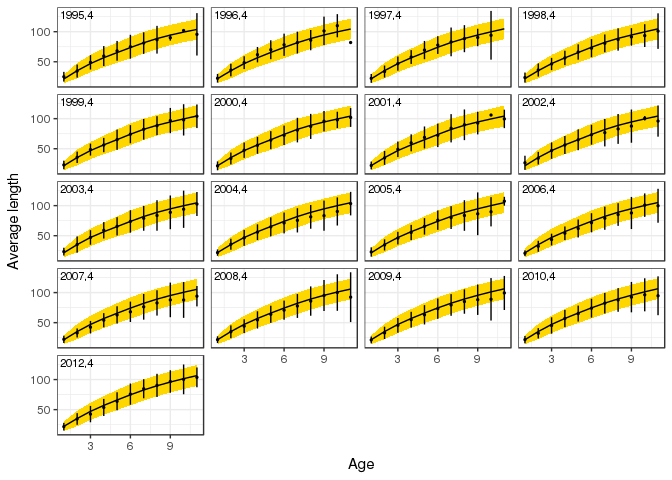<!-- -->

And the fit to maturity data:

```r
plot(fit,data='stockdist')
```

```
## $matp.igfs
```

```
## Warning: Removed 52 rows containing missing values (geom_point).
```

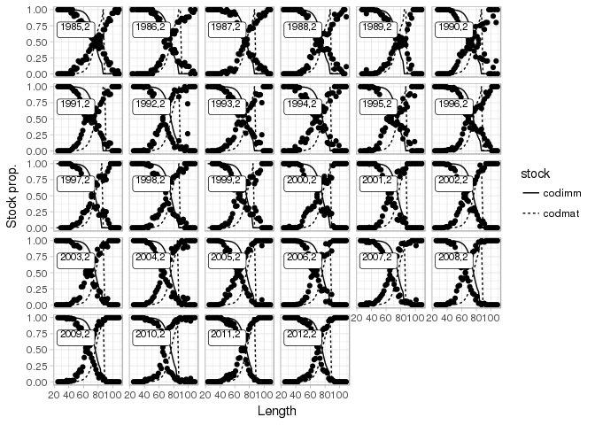<!-- -->

And selection by year and step

```r
plot(fit,data="suitability")
```

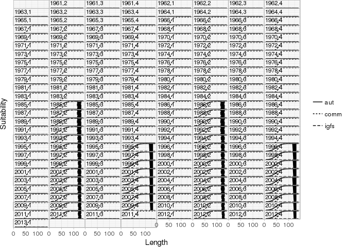<!-- -->

Age age compostion

```r
plot(fit,data='stock.std') + scale_fill_crayola()
```

<!-- -->


And the standard ices plots

```r
plot(fit,data='res.by.year',type='total') + theme(legend.position = 'none') +
  plot(fit,data='res.by.year',type='F') + theme(legend.position = 'none') +
  plot(fit,data = 'res.by.year',type='catch') + theme(legend.position = 'none') +
  plot(fit, data='res.by.year',type='rec')
```

```
## Warning: Removed 52 rows containing missing values (geom_path).
```

<!-- -->


Acknowledgements
----------------

This project has received funding from the European Union’s Seventh Framework
Programme for research, technological development and demonstration under grant
agreement no.613571.
